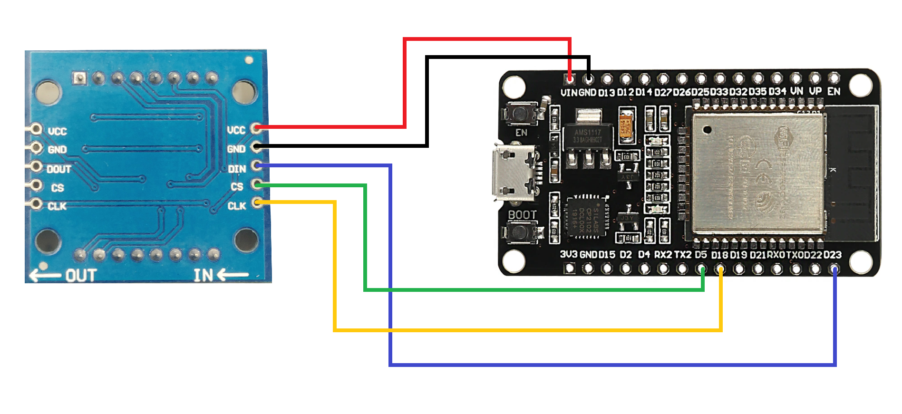
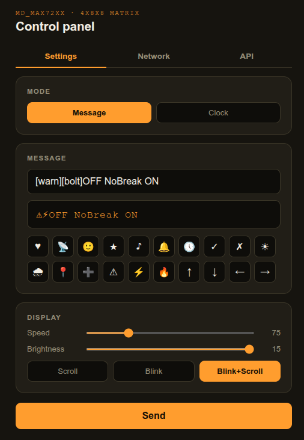
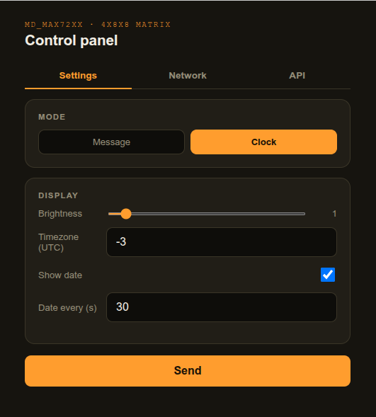

# ESP32 Matrix Display

Firmware for ESP32 that controls an LED matrix (MAX7219/MAX72XX, via
[MD_MAX72XX](https://github.com/MajicDesigns/MD_MAX72XX)) and turns it into a
WiFi-connected scrolling display, controllable via a web interface and a simple
REST API. Works as a message board, an NTP clock, or a Conway's Game of Life
display.

## Features

- **Three modes**: **Message** (scrolling/blinking text), **Clock** (NTP), or
  **Game of Life**, selectable in the web interface.
- **Clock mode (NTP)**: time in `HH:MM` with a blinking colon and small
  seconds digits, plus an optional date display (`DD/MM`) shown for a few
  seconds at a configurable interval. Timezone (UTC offset, half-hour
  steps supported), date on/off and interval are all configurable in the
  web interface — no reboot needed.
- **Game of Life mode**: Conway's Game of Life evolving on the full matrix
  (wrap-around board), automatically reseeding with a fresh random pattern
  whenever it settles into a still life or a short repeating cycle.
- **Web interface** to type and send scrolling messages to the display;
  the message box comes prefilled with the last message sent.
- **REST API** (`GET /api/display?msg=...`) to send messages and control the display programmatically — see the [API reference](docs/api.md).
- **Optional API key authentication** (`X-API-Key` header), generated and managed via the web interface.
- **WiFi setup portal**: if the configured network is not found, the device
  starts an Access Point (`MD-Display-Setup`) so you can configure the
  SSID/password from your browser.
- **Persistent settings** (mode, timezone, scroll speed, brightness, display
  mode) saved to NVS via `Preferences`, surviving reboots.
- **Built-in custom icons** inserted into messages with tags such as
  `[heart]`, `[wifi]`, `[smile]`, `[clock]`, `[star]`, and others.
- **Static mode with blink**, in addition to the default scroll mode.
- **Blink+Scroll mode**: blinks the visible part of the message for a few
  seconds, then scrolls once through the rest; messages that fit the
  display just blink.
- **Factory reset**: hold the BOOT button while powering on/resetting to erase
  all saved settings and credentials.

## Hardware

Tested with ESP32 + FC16 LED matrix module (MAX7219), 4 modules chained.

| Matrix (MAX7219) | ESP32 (hardware SPI / VSPI) |
|---|---|
| VCC      | VIN |
| GND      | GND |
| DIN      | D23 |
| CS       | D5  |
| CLK      | D18 |

Pins can be adjusted at the top of the `.ino` file (`CLK_PIN`, `DATA_PIN`, `CS_PIN`).



## Dependencies

- [Arduino core for ESP32](https://github.com/espressif/arduino-esp32)
- [MD_MAX72XX](https://github.com/MajicDesigns/MD_MAX72XX) (matrix control library)

## Getting Started

1. Compile and flash the firmware to the ESP32 (Arduino IDE or `arduino-cli`).
2. On first boot (no WiFi configured), the device starts the Access Point
   **MD-Display-Setup**. Connect to it and open the IP shown on the display
   (or `192.168.4.1`) in your browser.
3. Configure your network SSID/password via the web interface. The device
   restarts and attempts to connect; if it fails, it returns to setup mode.
4. Once connected, the display shows the assigned IP — open it in your browser
   to send messages, adjust brightness/speed, and manage the API key.

## Web Interface

Open the device IP in your browser to access the control panel. It has three
tabs: **Settings**, **Network**, and **API**.

### Message mode

Type the message (with live preview), insert icons with one click, and adjust
scroll speed, brightness, and the display mode (**Scroll**, **Blink**, or
**Blink+Scroll**). The message box comes prefilled with the last message sent.



### Clock mode

Switch the mode to **Clock** to show the NTP time. Here you configure the
timezone (UTC offset), brightness, and the optional date display (`DD/MM`)
with its interval in seconds. Changes apply without rebooting.



### Game of Life mode

Switch the mode to **Game of Life** to let Conway's Game of Life run on the
matrix. No settings to configure — the board seeds itself with a random
pattern on entry and reseeds automatically whenever it stalls.

### Network and API tabs

- **Network**: shows the current connection (SSID, IP, signal) and lets you
  change the WiFi credentials — saving reboots the device.
- **API**: enables/disables API key authentication and generates/regenerates
  the key used in the `X-API-Key` header.

## REST API

A single endpoint controls everything — message, speed, brightness, modes,
clock settings and temporary alerts:

```bash
curl "http://192.168.1.50/api/display?msg=Hello%20World"
```

Available parameters: `msg`, `spd`, `brt`, `mode` (scroll / blink /
blink+scroll), `alert`, `display` (message / clock / life), `tz`, `date`,
`dateint`. Authentication via the `X-API-Key` header is optional and
managed in the web interface.

See the **[REST API reference](docs/rest-api.md)** for the full parameter
table, authentication, icon tags, JSON responses, behaviour notes, and
plenty of curl examples.

## Integrations

- **[Home Assistant](docs/home-assistant.md)** — control the display with
  full parameter access via `rest_command`, with ready-to-use automation
  examples.

## Factory Reset

Hold the **BOOT** button on the ESP32 during power-on/reset to erase all saved
settings (WiFi, brightness, speed, API key) and return to factory defaults.

## Roadmap

- [x] Clock mode (NTP)
- [x] Game of Life mode
- [ ] Additional widgets/display modes
- [ ] Distribution via [ESP Web Tools](https://esphome.github.io/esp-web-tools/) (browser-based flashing, no Arduino IDE required)

## License

Define the project license here (e.g., MIT).
